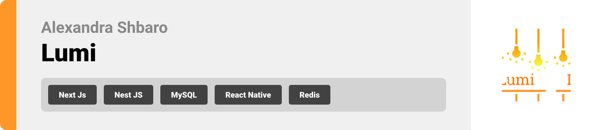

<br><br>

<!-- project philosophy -->


> Revolutionizing digital marketing collaboration: A platform that turns campaign management from chaos to clarity.
>
> Lumi aims to streamline the digital marketing workflow by providing a comprehensive platform for agencies to automate their processes, track campaign performance, and enable real-time client collaboration. We believe in enhancing marketing effectiveness by offering deep analytics, transparent communication, and tools that empower both agencies and clients to make informed decisions.

### User Stories
<p>Admin</p>
<ul>
<li>As a marketing agency admin, I want to create and manage campaigns, so I can efficiently organize multiple client projects in one platform.</li>
<li>As a marketing agency admin, I want to assign team members to specific tasks, so I can ensure projects are managed effectively.</li>
<li>As a marketing agency admin, I want to track overall campaign performance, so I can monitor the success of marketing initiatives and optimize workflows.</li>
</ul>
<p>Team Member</p>
<ul>
<li>As a team member, I want to automate marketing workflows, so I can reduce manual tasks and focus on strategic planning.</li>
<li>As a team member, I want to collaborate with other team members, so I can contribute to various stages of a campaign's execution.</li>
<li>As a team member, I want to receive notifications for task deadlines, so I can stay on track with campaign progress.</li>
</ul>
<p>Client</p>
<ul>
<li>As a client, I want to view real-time campaign progress and analytics, so I can track the performance of my marketing initiatives.</li>
<li>As a client, I want to provide feedback and approve campaign ideas, so I can actively collaborate with the marketing agency.</li>
<li>As a client, I want to request changes to campaign strategies, so I can ensure that the marketing efforts align with my business goals.</li>
</ul>
<br><br>
<!-- Tech stack -->


###  Lumi is built using the following technologies:

- This project uses the [Next.js](https://nextjs.org/) framework for building web applications. Next.js is a React-based framework that enables server-side rendering, static site generation, and automatic code splitting, which enhances the performance and scalability of web applications.
- For the backend, the project uses [NestJS](https://nestjs.com/), a progressive Node.js framework for building efficient, scalable, and maintainable server-side applications. NestJS leverages TypeScript and follows the modular architecture pattern, making it suitable for complex applications.
- For persistent storage (database caching), the app uses [Redis](https://redis.io/), an in-memory data structure store that can be used as a cache, message broker, and queue. Redis improves performance by providing quick access to frequently accessed data, supporting operations like key-value stores, lists, and sets.
- The app uses the font [Montserrat](https://fonts.google.com/specimen/Montserrat) as its font, and the design of the app adheres to modern web design principles.

<br><br>
<!-- UI UX -->


> We designed Lumi using wireframes and mockups, iterating on the design until we reached the ideal layout for easy navigation and a seamless user experience.

- Project Figma design [figma](https://www.figma.com/file/LsuOx5Wnh5YTGSEtrgvz4l/Purrfect-Pals?type=design&node-id=257%3A79&mode=design&t=adzbABt5hbb91ucZ-1)


### Mockups
| Login Screen  | Register Screen | Onboarding Screen 1|
| ---| ---| ---|
| 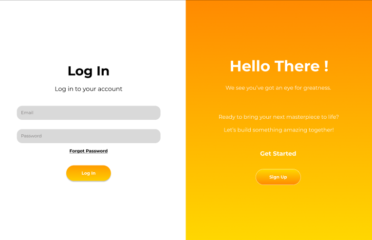 | 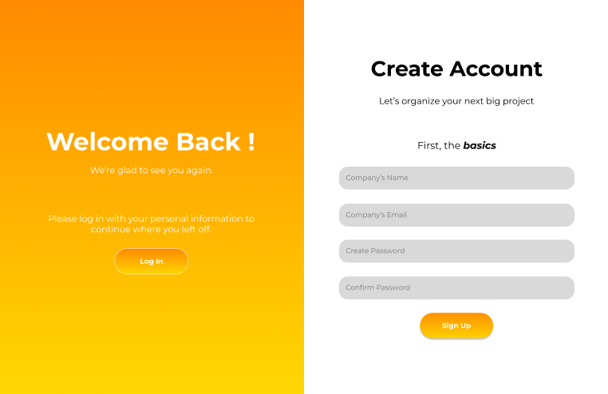 | 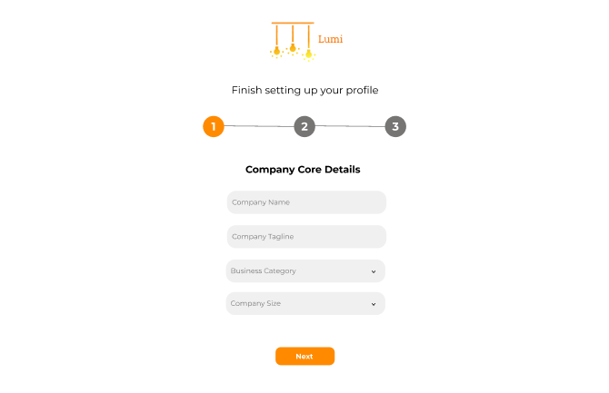 |
| Onboarding Screen 2 | Onboarding Screen 3 | Admin Dashboard Screen |
| 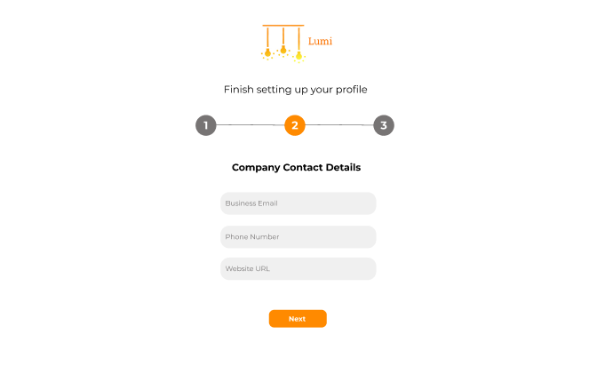 | 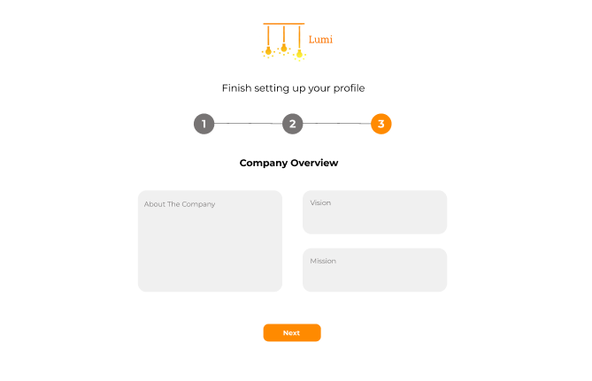 | 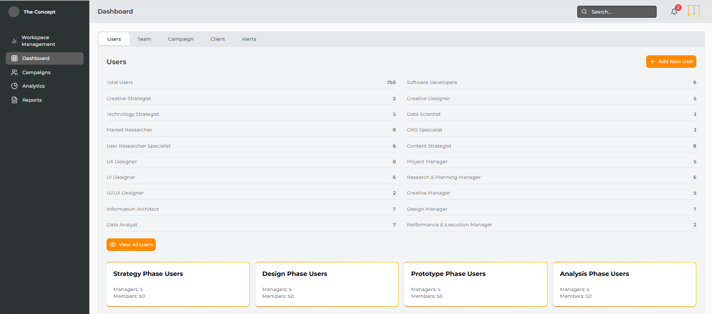 |
| Campaigns Overview Screen | Single Campaign Overview Screen | Analytics Overview Screen |
| 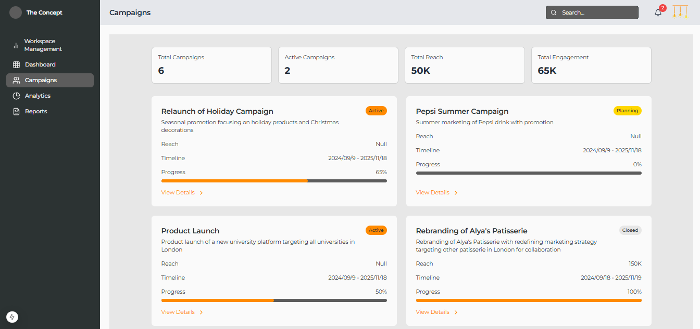 | 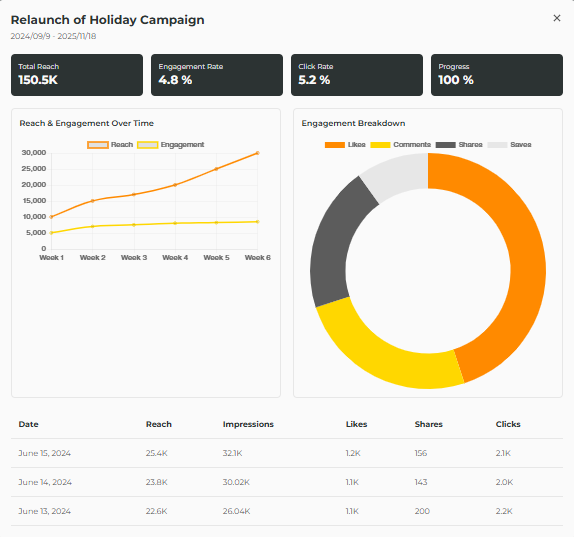 | 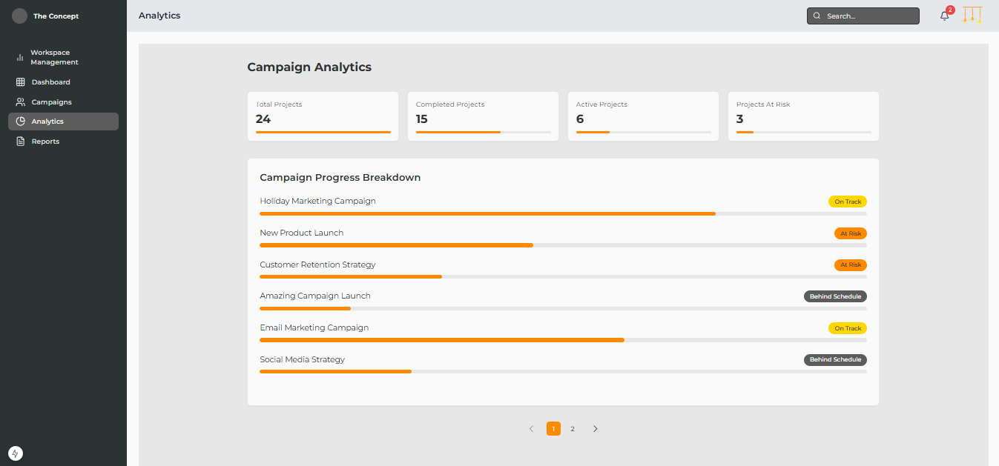 |
| Reports Screen | Account Management/Strategy Screen | Market Research/Strategy Screen |
| 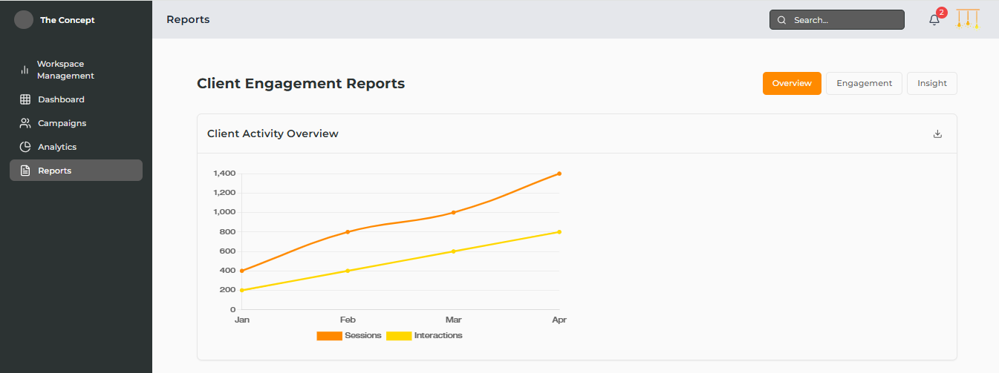 | 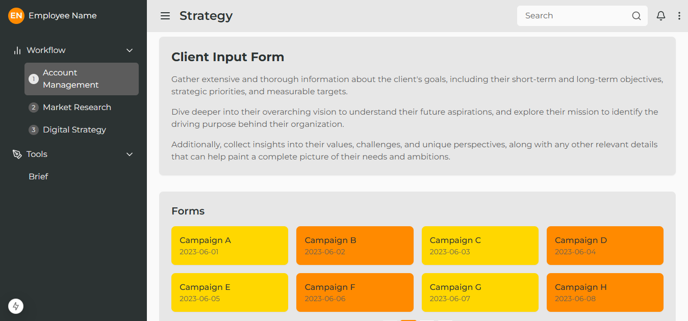 | 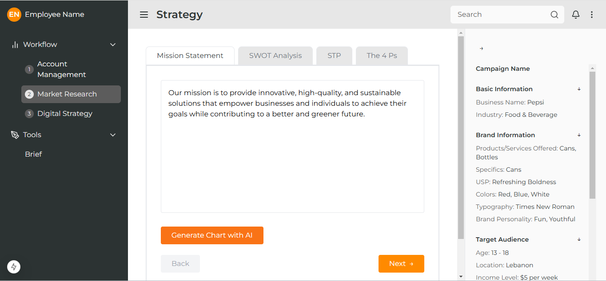 |
| Analysis Overview Screen | 
| 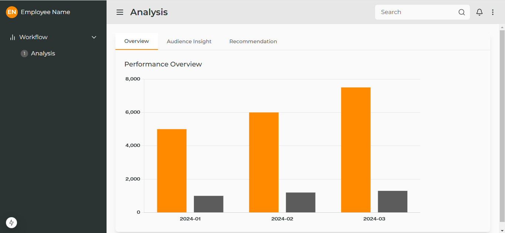 | 

<br><br>

<!-- Database Design -->
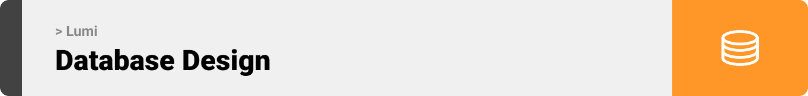

###  Architecting Data Excellence: Innovative Database Design Strategies:


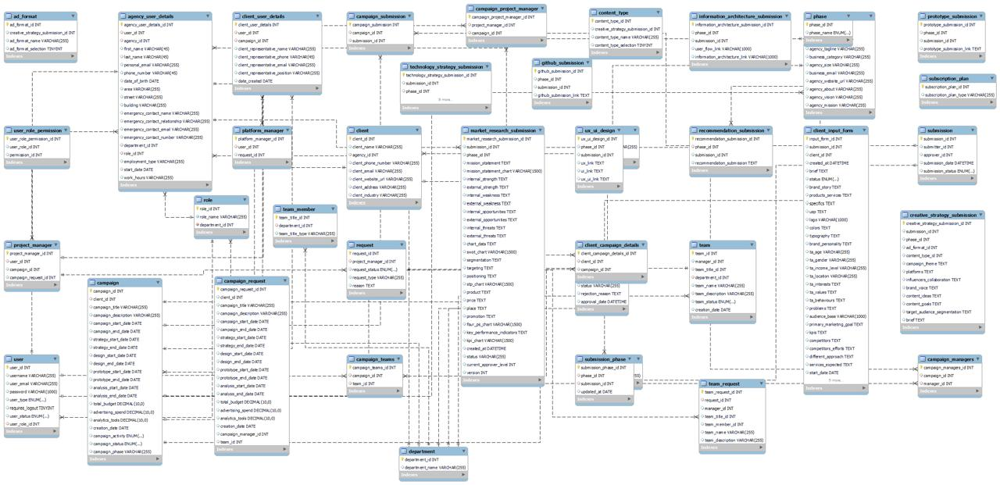 


<br><br>


<!-- Implementation -->


### Superadmin Screens 
| Register Screen  | Onboarding Screen |  Admin Screen |
| ---| ---| ---|
| 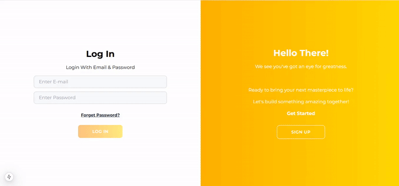 | 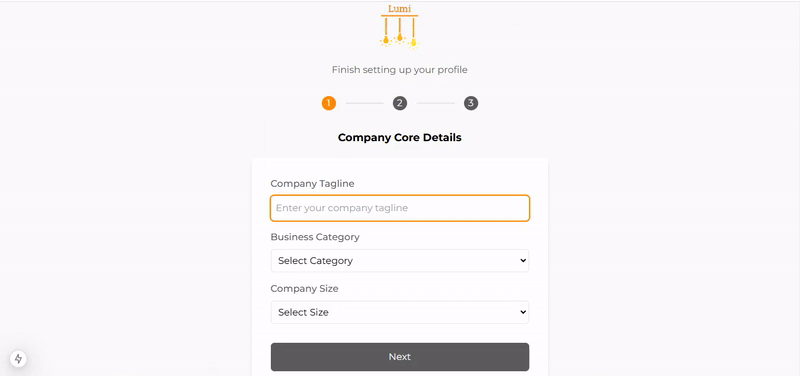 | 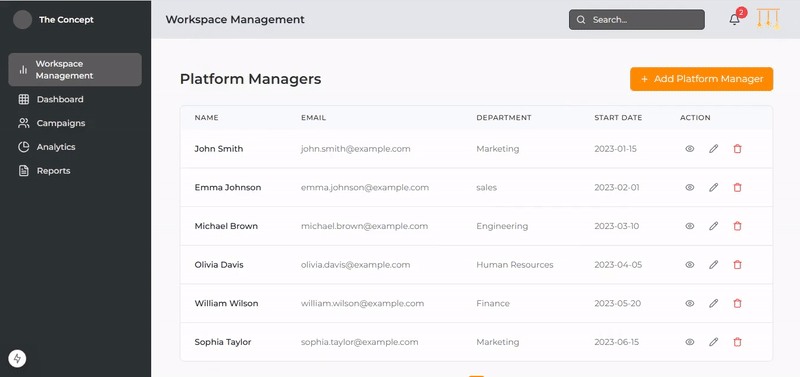 |
| Dashboard Screen  | Campaigns Screen | Reports Screen |
| 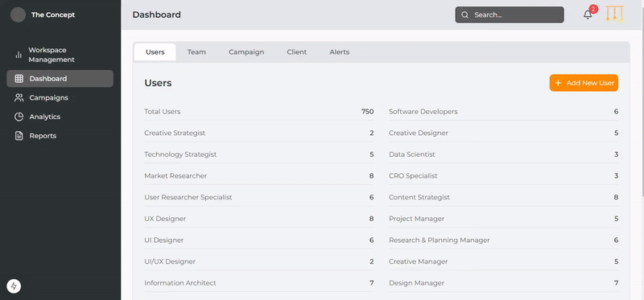 | 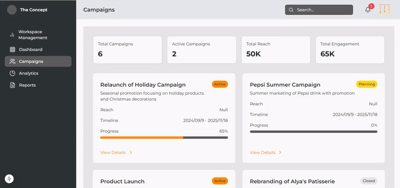 | 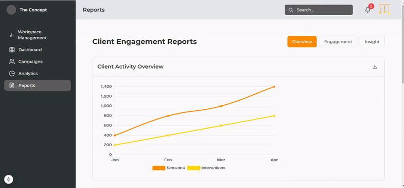 |

### Strategy Employee Screens 
| Account Management Screen  | Market Research Screen |  Digital Strategy Screen |
| ---| ---| ---|
| 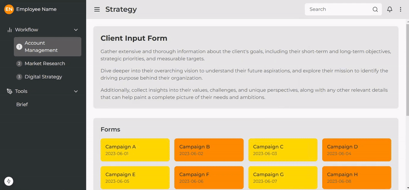 | 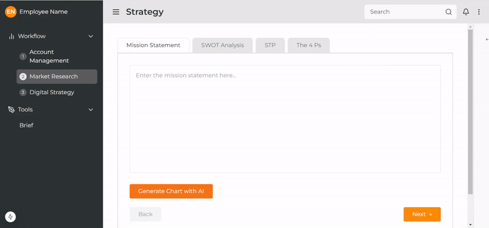 |  |

### Client Screens 
| Account Management Screen  | Market Research Screen |  Digital Strategy Screen |
| ---| ---| ---|
| 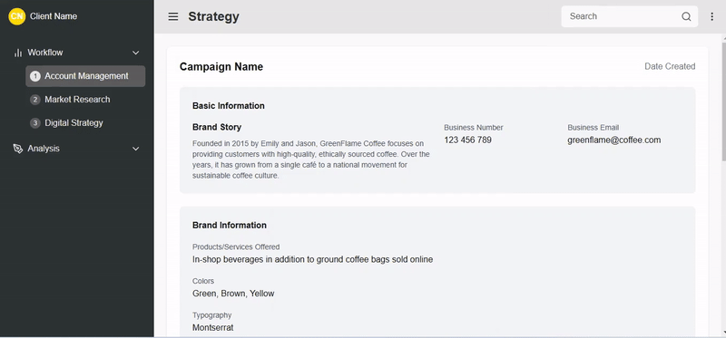 | 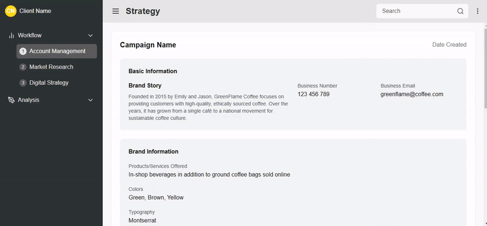 | 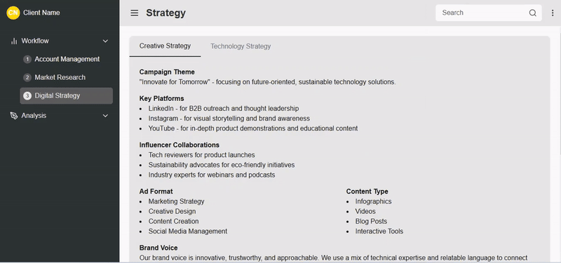 |

<br><br>


<!-- Prompt Engineering -->


###  AI-Enhanced Campaign Support:

- Using artificial intelligence tools, we streamlined our communication processes and strengthened our campaign analysis capabilities. Through thoughtful AI integration, we can now quickly identify best practices and optimize campaign performance while making our workflow more efficient.

<br><br>

<!-- How to run -->


> To set up Lumi locally, follow these steps:

### Prerequisites

To use Lumi, you need install the following: 
* Download and install Node.js from the official website: [Node.js](https://nodejs.org/en/download)
* npm
  ```sh
  npm install npm@latest -g
  ```

### Installation

1. Get a free API Key at [example](https://example.com)
2. Clone the repo
   git clone [github](https://github.com/Alexandra-Shbaro/Lumi.git)
3. Install NPM packages
   ```sh
   npm install
   ```

Now, you should be able to run Lumi locally and explore its features.
