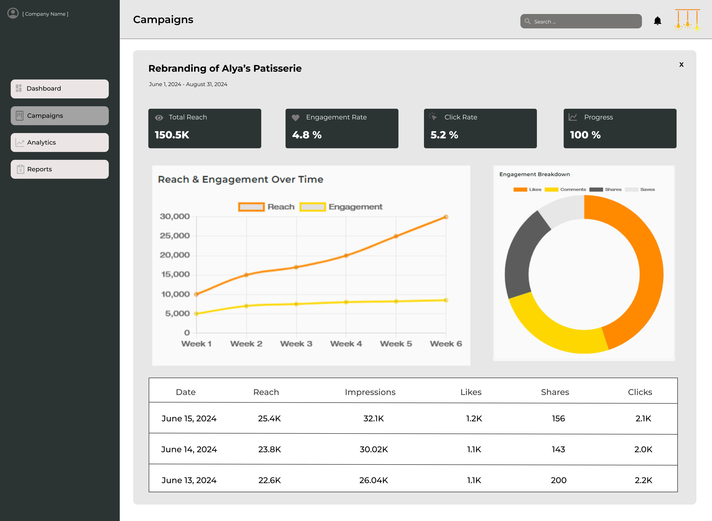
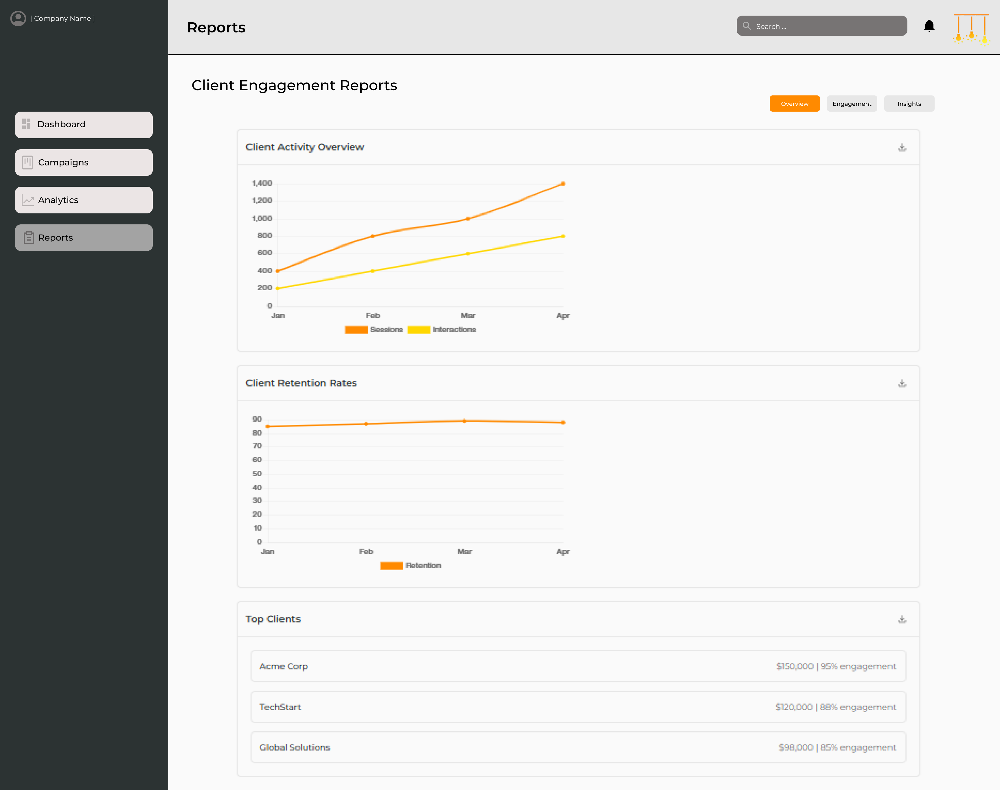
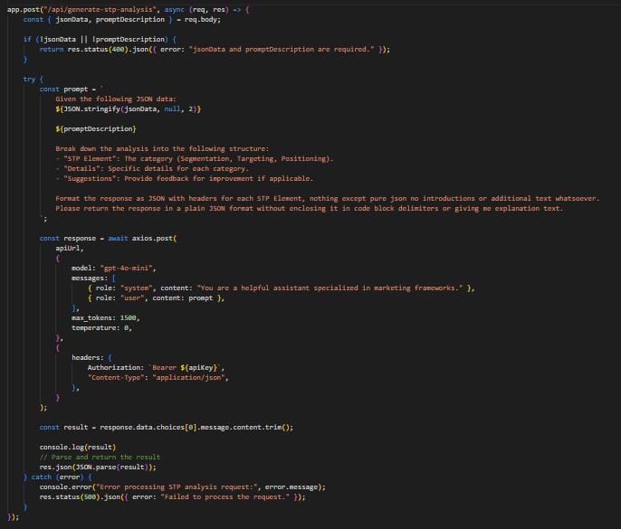
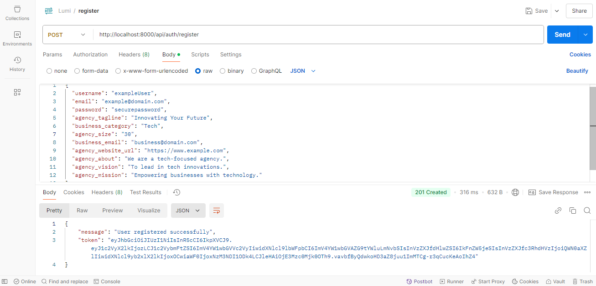
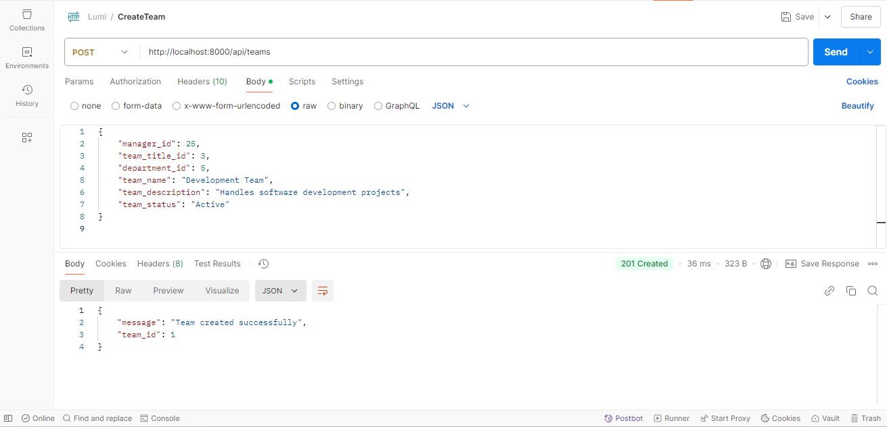
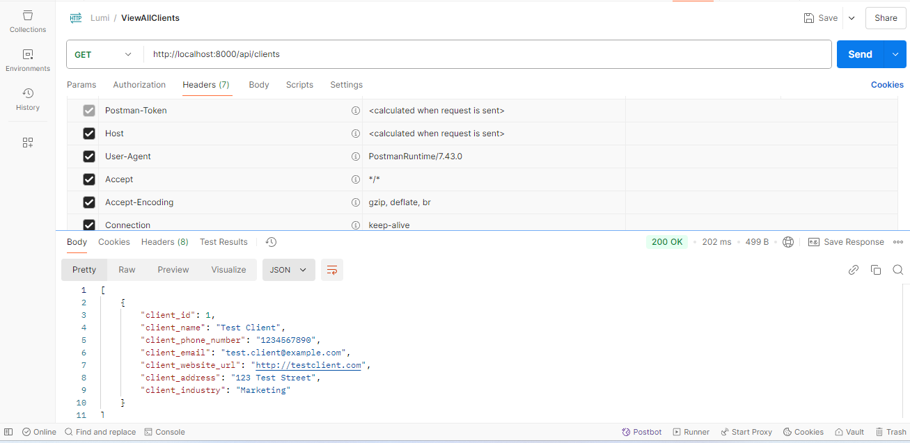

<br><br>

<!-- project philosophy -->


> Revolutionizing digital marketing collaboration: A platform that turns campaign management from chaos to clarity.
>
> Lumi aims to streamline the digital marketing workflow by providing a comprehensive platform for agencies to automate their processes, track campaign performance, and enable real-time client collaboration. We believe in enhancing marketing effectiveness by offering deep analytics, transparent communication, and tools that empower both agencies and clients to make informed decisions.

### User Stories
<p>Admin</p>
<ul>
<li>As a marketing agency admin, I want to create and manage campaigns, so I can efficiently organize multiple client projects in one platform.</li>
<li>As a marketing agency admin, I want to assign team members to specific tasks, so I can ensure projects are managed effectively.</li>
<li>As a marketing agency admin, I want to track overall campaign performance, so I can monitor the success of marketing initiatives and optimize workflows.</li>
</ul>
<p>Team Member</p>
<ul>
<li>As a team member, I want to automate marketing workflows, so I can reduce manual tasks and focus on strategic planning.</li>
<li>As a team member, I want to collaborate with other team members, so I can contribute to various stages of a campaign's execution.</li>
<li>As a team member, I want to receive notifications for task deadlines, so I can stay on track with campaign progress.</li>
</ul>
<p>Client</p>
<ul>
<li>As a client, I want to view real-time campaign progress and analytics, so I can track the performance of my marketing initiatives.</li>
<li>As a client, I want to provide feedback and approve campaign ideas, so I can actively collaborate with the marketing agency.</li>
<li>As a client, I want to request changes to campaign strategies, so I can ensure that the marketing efforts align with my business goals.</li>
</ul>
<br><br>
<!-- Tech stack -->


###  Lumi is built using the following technologies:

- For the frontend, the project uses the [Next.js](https://nextjs.org/) framework for building web applications. Next.js is a React-based framework that enables server-side rendering, static site generation, and automatic code splitting, which enhances the performance and scalability of web applications.
- For the backend, the project uses [Express JS](https://expressjs.com/), minimal and flexible Node.js web application framework that provides a robust set of features for web and mobile applications.
- For persistent storage, the app uses [MySQL](https://www.mysql.com/), a relational database management system that provides reliable and efficient data storage. 
- For authentication, the app uses [NextAuth](https://next-auth.js.org/), a flexible and secure authentication library for Next.js applications. NextAuth simplifies the implementation of authentication by providing built-in support for various providers, session management, and JWT handling, ensuring smooth user login and access control.
- The server uses JWT tokens and the [Jose](https://www.npmjs.com/package/jose) library to ensure all data stays protected and communications between users and the server remains private.
- The server uses [Node.js](https://nodejs.org/en) to connect with OpenAI's API, enabling AI-powered chart generation capabilities.
- The app uses the font [Montserrat](https://fonts.google.com/specimen/Montserrat) as its font, and the design of the app adheres to modern web design principles.
- In the future, a mobile version of the app will be developed using [React Native](https://reactnative.dev/).

<br><br>
<!-- UI UX -->


> We designed Lumi using wireframes and mockups, iterating on the design until we reached the ideal layout for easy navigation and a seamless user experience.

- Project Figma design [figma](https://www.figma.com/file/LsuOx5Wnh5YTGSEtrgvz4l/Purrfect-Pals?type=design&node-id=257%3A79&mode=design&t=adzbABt5hbb91ucZ-1)


### Mockups
| Single Campaign Overview Screen | Reports Screen | 
| ---| ---| 
|  |  | 

<br><br>

<!-- Database Design -->


###  Architecting Data Excellence: Innovative Database Design Strategies:


<br><br>


<!-- Implementation -->


### Superadmin Screens 
| Onboarding Screen |  Admin Screen |
| ---| ---|
|  |  |
| Dashboard Screen  | Campaigns Screen | 
|  |  | 
| Reports Screen |
|  |

### Strategy Employee Screens 
| Account Management Screen  | Market Research Screen |   
| ---| ---|
|  |  |
| Digital Strategy |
|  |

### Client Screens 
| Account Management Screen  | Market Research Screen|
| ---| ---|
|  |  |
| Digital Strategy Screen |
|  |

<br><br>


<!-- Prompt Engineering -->


###  AI-Enhanced Campaign Support:

- The application converts employee data into visual analytics using AI capabilities. As team members submit their information, the system generates comprehensive charts while providing intelligent suggestions for plan optimization. This ensures data sharing across departments is clear and well structured with helpful insights rather than raw information.



<br><br>

<!-- AWS Deployment -->


<ul>
  <li>The project runs on AWS cloud infrastructure, with the backend hosted on an EC2 server. This setup gives us the flexibility to scale as needed while keeping everything running smoothly.</li>
  <li><b>API Documentation: </b>Detailed API documentation can be accessed through <a href="https://documenter.getpostman.com/view/39583738/2sAYQcGrAV">Postman</a></li>
  <li>Visit our live server website at <a href="https://lumi.com">lumi.com</a></li>
</ul>

| Register Endpoint | Create Team |
| ---| ---|
|  |  |

| View All Clients | Edit Campaign |
| ---| ---|
|  | 

<!-- How to run -->


> To set up Lumi locally, follow these steps:

### Prerequisites

To use Lumi, you need install the following: 
* Download and install Node.js from the official website: [Node.js](https://nodejs.org/en/download)
* npm
  ```sh
  npm install npm@latest -g
  ```

### Installation

1. Clone the repo
   git clone [github](https://github.com/Alexandra-Shbaro/Lumi.git)
2. Install NPM packages
   ```sh
   npm install
   ```
3. Run the Next JS App
   ```sh
   npm run dev
   ```
4. Run the Express JS Server
   ```sh
   node server
   ```

Now, you should be able to run Lumi locally and explore its features.
